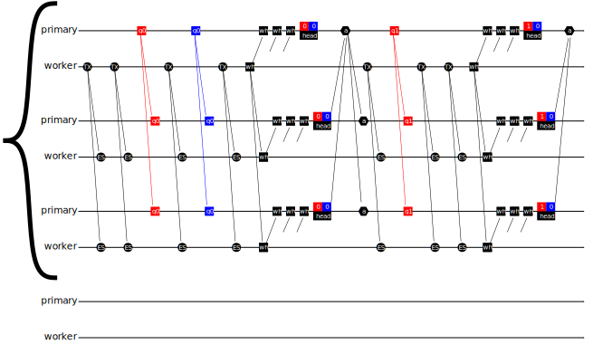
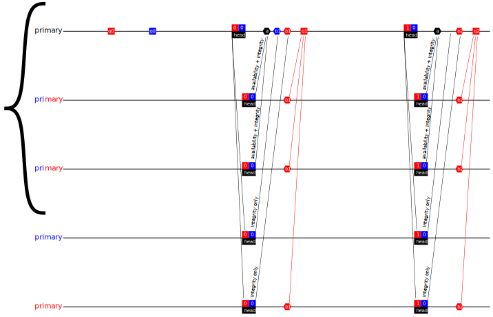
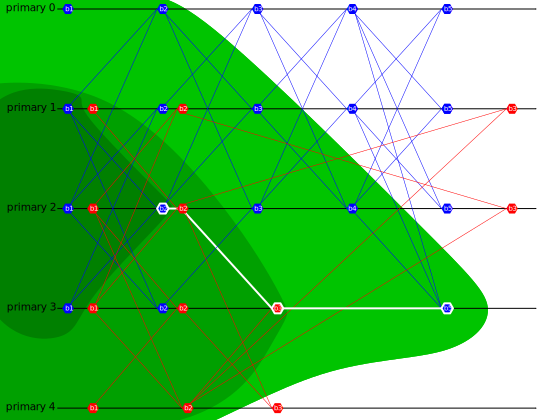

# Mempool

## Summary
Validators run the mempool protocol. 
They receive transactions from clients, store them, and make them available for the [execution engine](execution.md) to read. 
The mempool protocol, which is based on [Narwhal](https://arxiv.org/abs/2105.11827) also produces a [DAG](https://en.wikipedia.org/wiki/Directed_acyclic_graph) of *headers*, which reference batches of transactions (via hash), and prove that those transactions are available for the [execution engine](execution.md). 
These headers are ultimately what the [consensus](heterogeneous_paxos.md) decides on, in order to establish a total order of transactions.

## Heterogeneous Narwhal
The core idea here is that we run an instance of Narwhal for each learner. 
For chimera chains, an "atomic batch" of transactions can be stored in any involved learner's Narwhal. 

We also make 2 key changes:
- The availability proofs must show that any transaction is sufficiently available for all learners. 
This should not be a problem, since in Heterogeneous Paxos, for any connected learner graph, any learner's quorum is a weak quorum for all learners. 
- Whenever a validator's Narwhal primary produces a batch, it must link in that batch not only to a quorum of that learner's block headers from the prior round, but also to the most recent batch this validator has produced *for any learner*. 
This ensures that, within a finite number of rounds (3, I think), any transaction batch referenced by a weak quorum of batches in its own Narwhal will be (transitively) referenced by all batches in all Narwhals for entangled learners. 

### Overview
Like [Narwhal](https://arxiv.org/abs/2105.11827) Heterogeneous Narwhal Validators have multiple concurrent processes (which can even run on separate machines).
Each validator has one *primary* process and many *worker* processes. 
When a client submits a transaction, they first send it to a worker process.

#### Workers
Worker processes ensure transactions are available. 
Transactions are batched, and erasure-coded (possibly simply replicated) across a *weak quorum for every learner* of workers, and only signed hashes of those batches are sent to primaries. 
This separates the high-bandwidth work of replicating transactions from the ordering work of the primaries. 

#### Primaries
Primary processes establish a partial order of transaction batches (and by extension transactions), in the form of a structured DAG.
The DAG proceeds in *rounds* for each learner: each primary produces at most one block for each (correct) learner in each round. 
That block references blocks from prior rounds. 

Primaries assemble headers (both their own and for other primaries) from collections of worker hashes, and references to prior blocks. 
They then sign votes, stating that they will not vote for conflicting headers, and (optionally) that their workers have indeed stored the referenced transactions. 
Primaries collect votes concerning their own headers, producing blocks: aggregated signatures showing a header is unique. 

More formally, we present the Heterogeneous Narwhal protocol as the composition of two crucial pieces: the Heterogeneous Narwhal Availability protocol, and the Heterogeneous Narwhal Integrity protocol. 

### Vocabulary
- *Learner*s dictate trust decisions: just like in Heterogeneous Paxos, we use a Learner Graph. In diagrams, we usually represent learners with colors (red and blue).
-  *Quorum*: a set of validators sufficient for a Learner to make blocks. Each Learner has a set of quorums.
- *Intact Learner*: any 2 quorums for an Intact Learner have a correct validator in their intersection. Most of our guarantees apply only to Intact Learners.
- *Entangled Learners*: a pair of learners *A* and *B* are entangled if, for any quorum *Qa* of *A*, and any quorum *Qb* of *B*, the intersection of *Qa* and *Qb* contains a correct validator. 
Some guarantees apply pairwise to Entangled Learners: they are, in a sense, guaranteed to agree on stuff. 
-  *Weak Quorum*: a set of validators that intersects every quorum. Weak Quorums are Learner-specific, so when we say *weak quorum for every learner* we mean a set of validators that intersects every quorum of every Learner. 
-  *Transaction*: data from clients to be ordered. We do not specify how it's formatted. 
- *Batch* a set of transactions collected by a Worker.
-  *Erasure Share*: data transmitted to a weak quorum of listening workers, such that any Quorum of validators can re-construct the original data (Transaction or Batch of Transactions).
-  *Worker Hash*: a signed digest of a batch of transactions collected by (and signed) by a worker.
-  *Header*s have:
  - an associated Primary (who "created" this header)
  - a set of Worker Hashes (from workers on the same validator as this primary)
  - an Availability Certificate for the previous Header issued by this primary
  - at most one Signed Quorum for each Learner
-  *Availability Certificate*: an aggregation of signatures from a Weak Quorum attesting that everything referenced by a particular Header is available. Must include a signature from the Header's primary. 
-  *Block*: an aggregation of Header signatures from a quorum of a specific learner attesting that they will not attest to any conflicting header. Also includes an Availability Certificate. Should include all signatures a primary has gathered for that header at the time (signatures in the Availability Certificate count).
-  *Signed Quorum*: a quorum of blocks with the same learner and round, signed by a primary. These are referenced in headers. 

## Heterogeneous Narwhal Availability Protocol

(note the giant curly-brace represents a Weak Quorum of validators)

### Batches and Worker Hashes
When a worker has collected a batch of transactions, it transmits erasure shares (possibly full copies) of those transactions to other workers on a *weak quorum for every learner* of validators. 
What's important about this erasure coding is that any Quorum of any Learner can reconstruct every transaction. 
Furthermore, workers must be able to verify that they are in fact storing the correct Erasure Share of the data referenced in the Worker Hash.
One way to accomplish this is to transmit a complete copy of all the data to an entire weak quorum for every learner. 

In fact, rather than wait until a batch is complete to start transmitting, workers can stream erasure shares as they receive transactions. 
When it has completed a batch, a worker also transmits a signed *Worker Hash* to those other workers, and its own primary.
We do not specify when workers should complete batches, but perhaps it should be after some timeout. Batches should not be empty. 

### Signed Quorums and Headers
TODO

## Heterogeneous Narwhal Integrity Protocol
TODO

## DAG Properties
TODO

## Consensus
TODO

